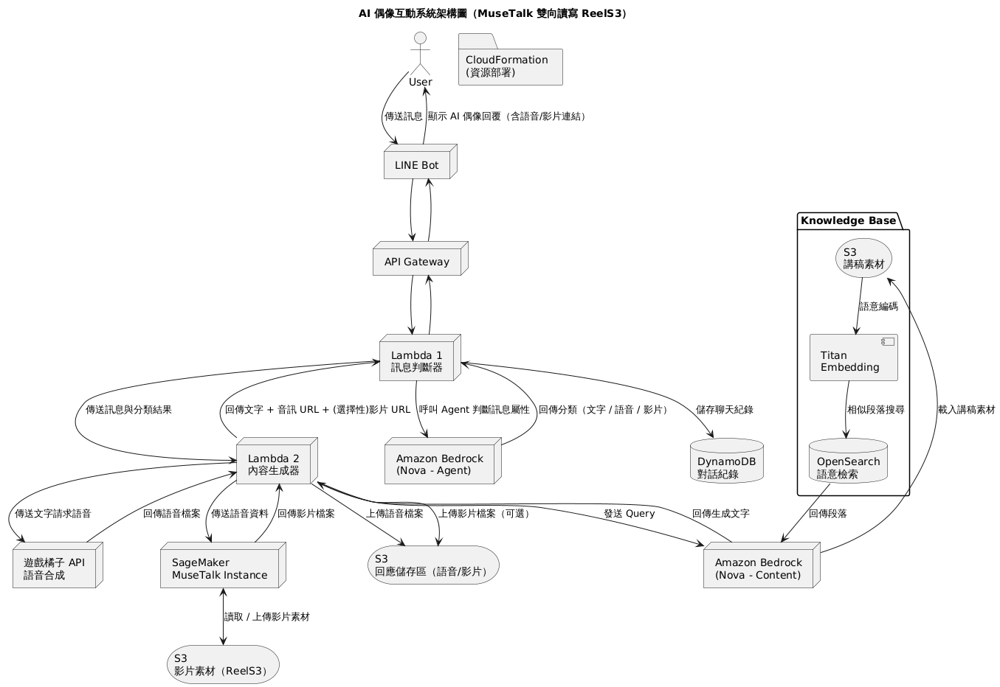

# AWS-HACKTHON, 眾量橘

## How to use
- EMPTY


## System Architecture



## Functions
| 模組 | 任務內容 |
|------|----------|
| LINE Bot | 建立 webhook + LINE Developer 註冊與 channel 實作 |
| API Gateway | 設定接收 POST 請求並連接 Lambda 1 |
| Lambda 1（訊息判斷器） | 根據 input 分類：文字 / 語音 / 影片 |
| Lambda 2（內容生成器） | 串接 Bedrock Nova 並處理後續語音 / 影片合成 |
| Bedrock (Nova) | 設定 S3 知識資料上傳、Titan Embedding、OpenSearch |
| Voice API | 串接遊戲橘子 API 產出語音，測試回傳音訊格式 |
| SageMaker (MuseTalk) | 在 SageMaker 上安裝並測試合成流程 |
| DynamoDB | 設計資料表並串接 Lambda 紀錄每次互動 |
| CloudFormation | 撰寫 YAML 建立 API GW、Lambda、S3、DynamoDB 等資源 |

## Next Action
watch next.md


## External Packages
1. Public Voice API
- Documentation: [PublicVoiceAPI-FEniX.pdf](https://reurl.cc/4L1MEK)
- Response Examples:
  - mode=stream:
    ```json
    {
      "message": "success",
      "media_url": "https://cdn.data.gamania.com/persona-sound/20241014/ting/05870db4-6b07-48a0-b7f0-3ed69e137989.wav"
    }
    ```
  - mode=file: Binary file content

2. MuseTalk
- Documentation: [MuseTalkInstallationandSetupGuide.pdf](https://reurl.cc/QYLo8p)
- Input: 
  - .wav (audio)
  - .mp4 (video)
- Output: .mp4 (video)

## TeamMembers
ray-qwer
derek890111

## Reference
### AWS Educate Workshop - 呀哈！以 AWS Bedrock + AI Agent 打造單身「吉」地獄
https://github.com/aws-educate-tw/aws-educate-chiikawa-ai-workshop/tree/main


